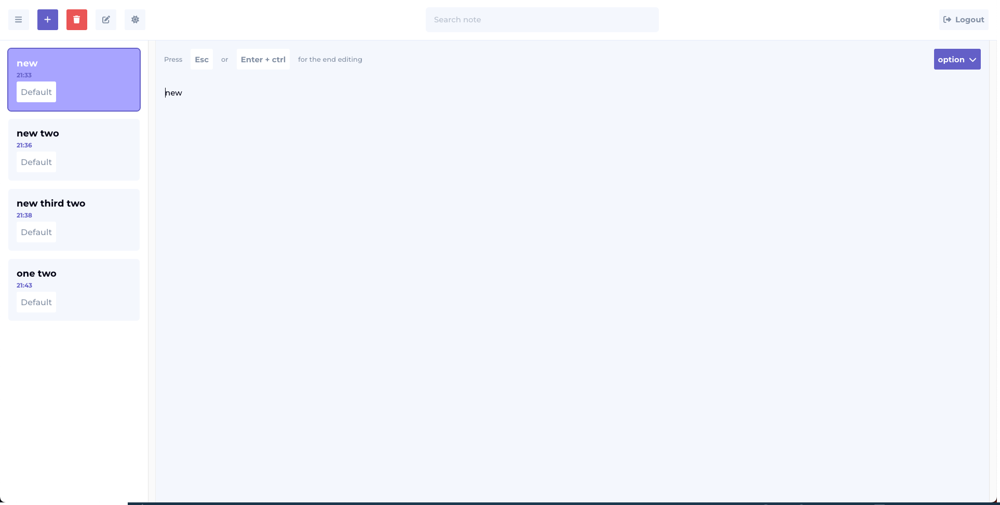

# Текстове завдання [note app](https://www.t.me/hr_inboost_bot)

## Table of contents

- [Overview](#overview)
  - [Preview](https://note-app-react-lointainy.netlify.app/)
  - [API](https://note-app-server-lointainy.vercel.app/)
- [My process](#my-process)
  - [Built with](#built-with)
- [Status](#project-status)
- [Author](#author)

## Overview

## My process

###### Built with

- [HTML](https://developer.mozilla.org/en-US/docs/Web/HTML)
- [CSS](https://developer.mozilla.org/en-US/docs/Web/CSS)
- Node modules
  - [fontsource](https://fontsource.org/docs/getting-started)
  - [fontawesome](https://fontawesome.com/)
  - [sass](https://sass-lang.com/)
- [REACT](https://reactjs.org/) - framework / function component
  - [router](https://reactrouter.com/en/main)
  - [redux-toolkit](https://redux-toolkit.js.org/)
  - [QTK query](https://redux-toolkit.js.org/rtk-query/overview)
- [Node](https://nodejs.org/en/docs/) - library
- [express](https://expressjs.com/) - framework for nodeJs
- [MongoDB](https://www.mongodb.com/docs/manual/) - database

###### What i Used

- Backend
- mongoDB
- NodeJs
  - express
  - res, req
  - routing
  - auth JWT
  - swagger
- Fronend
- REACT
  - Components
    - function components
  - Props
  - Hooks
  - customHooks
  - Router
    - Routes
    - Route
    - Router hooks
    - Params, Navigate
  - Store
    - retux toolkit
      - QTK query

###### Project status

###### Author

